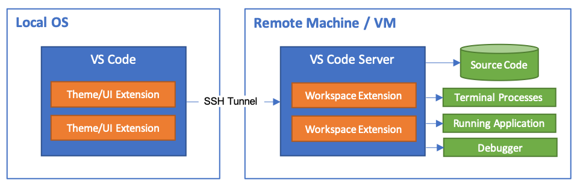

# Rasberry Pi Toolkit

A set of scripts and tooling to remotely setup and control Rasberry Pi's.

## Main features & functionality

The tooling and functionality included in this repository:

- [./setup](./setup) - Scripts used to install various pieces of software
- [./remote](./remote) - Some utility scripts to remotely control a device through ssh
- [./backups](./backups) - Backups will be stored here by default

## Quickstart

The following quickstart guides will help you to get going.

### Run remote scripts from a github repo (on your machine or Rasberry Pi )

To save time and effort by not having to type endless commands into a terminal,
we can make use of statically hosted scripts that are included in this repo.

```bash
# ------------------------------------------------------------------
# From the Rasberry Pi
# ------------------------------------------------------------------
export REPO_URL=https://raw.githubusercontent.com/JohnnyBeProgramming/pi-toolkit/master

# Install applications & tools from remote scripts...
curl ${REPO_URL}/setup/ssh | bash
curl ${REPO_URL}/setup/transmission | bash

# ------------------------------------------------------------------
# From your local machine
# ------------------------------------------------------------------
export TARGET_HOST=pi@192.168.1.1

# Make a backup of a remote device
curl ${REPO_URL}/remote/backup | bash -s ${TARGET_HOST}

```

### Setup an SSH agent on the Rasberry Pi

This enables us to remotely control the device, and perform actions such as
backup and restore, or even remote development (using `vscode`).

Run the following command to install ssh (requires an active internet connection):

```bash
# Exposes an ssh server on the device
curl -s https://raw.githubusercontent.com/JohnnyBeProgramming/pi-toolkit/master/setup/ssh | bash
```

Now you can connect to the remote device using your device username and the `ssh` command:

```bash
# Test the connection from your host to the remote device
# Hint: Use the IP that was resolved in the step above

ssh pi@192.168.1.1
# Now you are in the remote device...

exit # Type 'exit' to terminate the ssh session...
```

Now that we established a connection, the next step would be to remotely control
the device from our local machine.

### Synchronise files to and from your remote device

To do this, we will make use of the SSH connection that we installed and enabled
on the device.

```bash
export TARGET_HOST=pi@192.168.1.1
export DEVICE_PATH=/home/pi
export LOCAL_PATH=./exported

# Sync files to and from a device
./remote/sync-from ${TARGET_HOST} ${DEVICE_PATH} ${LOCAL_PATH}
./remote/sync-to   ${TARGET_HOST} ${DEVICE_PATH} ${LOCAL_PATH}

```

### Remotely control a device from your local machine

Now that we can synchronize files from and to the device, the next step would be to
do remote development on the target device, from our local machine (using `vscode`).

We do this, because typically the Rasberry Pi has very low resources, and installing
a full development IDE on it would just occupy valuable resources.

Using vscode in remote development mode gives us a better user experience, because
we are using our local keyboard/mouse and video/memory, while in the context of the
remote host.



For more information, see: https://code.visualstudio.com/blogs/2019/07/25/remote-ssh
